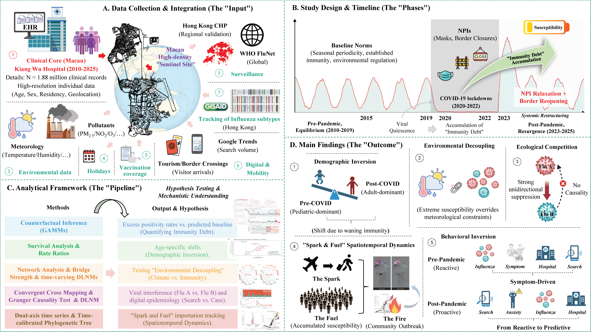

This repository includes R code to run all of the analysis for the paper "**Post-pandemic immunity debt and environmental decoupling reshape urban influenza transmission**" and to produce the main figures of the paper.

# Graphical Abstract



# Overview

The relaxation of non-pharmaceutical interventions after the COVID-19 pandemic was followed by a global resurgence of respiratory pathogens, but how accumulated susceptibility interacts with environmental forcing and human mobility remains unclear. Here, we leverage a large, multi-source dataset spanning 2010-2025, centred on ~1.88 million longitudinal clinical influenza testing records from Macau, and triangulate these data with high-resolution meteorology and air quality, digital information-seeking signals, independent clinical surveillance and time-resolved viral phylogenies from Hong Kong, and global WHO FluNet time series for external benchmarking. We first characterize post-pandemic shifts in influenza subtype composition and seasonal timing relative to historical baselines. Counterfactual inference against pre-pandemic baselines indicates a substantial post-pandemic excess in influenza activity consistent with an "immunity debt", observed in Macau and Hong Kong and aligning with global resurgence patterns in WHO FluNet. Age-stratified analyses further reveal a "demographic inversion", with a disproportionate rise in susceptibility among adults relative to children in both cities, compatible with waning protection in previously exposed cohorts. Government-reported influenza vaccination coverage in high-risk groups (2015-2025) did not decline after reopening and increased in several strata, indicating that reduced vaccine coverage is unlikely to account for the post-pandemic resurgence. Network analysis and time-varying association models identify "environmental decoupling", wherein elevated population susceptibility attenuated typical meteorological constraints and was associated with sustained influenza A transmission under less favourable climatic conditions. To test whether this high-activity influenza A regime reshaped inter-type interactions, convergent cross mapping and complementary time-series analyses support an asymmetric effect of influenza A on influenza B, consistent with competitive suppression of influenza B during periods of intense influenza A activity. Spatiotemporal reconstruction supports a "Spark and Fuel" dynamic in which cross-border travel seeded local outbreaks that expanded from ports of entry into high-density residential areas, with regional time-resolved phylogenies providing convergent evidence for heightened reintroduction pressure after reopening. Finally, we observe a “behavioral inversion” in which digital information-seeking became more tightly synchronized with clinical burden and in some periods preceded it during the post-pandemic era. Together, these findings indicate a post-pandemic regime shift in influenza dynamics rather than a simple return to historical baselines, motivating adaptive, multi-source surveillance for high-density urban environments.

 

**Keywords**: Influenza; immunity debt; environmental decoupling; viral interference; spatiotemporal dynamics; digital epidemiology

# *Nature* Research Code Submission Items

Following: https://www.nature.com/documents/nr-software-policy.pdf

# Repo Contents

- [Scripts](./Scripts): R scripts for data processing, statistical modeling, and figure generation. *If not otherwise specified, this analysis is typically completed within a few minutes.*

  + `3D_DLNM.R`. Performs Distributed Lag Non-linear Model (DLNM) analysis to estimate the delayed effects of meteorological factors on influenza. Code for generating 3D exposure-lag-response surface plots and overall cumulative association curves.

  + `Age_specific_susceptibility_shift.R`. Analyzes age-stratified shifts in influenza susceptibility between pre- and post-pandemic periods in Macau. Generates cumulative incidence curves and calculates Rate Ratios (RR) to quantify changes in seasonal timing and infection intensity across age groups.

  + `Age_specific_susceptibility_shift_HK.R`. Performs a comparative analysis of pre- vs. post-pandemic influenza rates in Hong Kong. Generates forest plots of age-specific Rate Ratios (RR) to assess susceptibility shifts.

  + `Anuual_counts_of_specimens.R`. Processes clinical surveillance data to quantify the annual distribution of laboratory-confirmed Influenza A, Influenza B, and non-influenza specimens. Code for generating the descriptive sample size table and the corresponding stacked bar chart visualizing specimen counts and proportions.
  + `Weekly_incidence_proxies.R`. Processes weekly influenza surveillance data to identify and annotate epidemic peaks based on threshold crossings. Generates longitudinal incidence plots for influenza A and B, highlighting distinct epidemic phases from the pre-pandemic to post-pandemic periods.
  + `Weekly_incidence_proxies_HK.R`. Processes Hong Kong weekly influenza surveillance data to identify and annotate epidemic peaks based on threshold crossings. Generates longitudinal incidence plots for influenza A and B, highlighting distinct epidemic phases from the pre-pandemic to post-pandemic periods.

  + `Evolution_of_healthcare_seeking_behavior.R`. Performs comprehensive causal inference analysis to characterize the evolving relationship between influenza activity and healthcare-seeking behavior (internet searches) across pre- and post-pandemic periods. Implements a multi-method approach including Cross-Correlation Function (CCF), linear and non-linear (GAM) Granger causality tests, and Convergent Cross Mapping (CCM) with surrogate data significance testing. Code for generating composite figures illustrating time series trends, causality statistics, embedding dimension sensitivity, and CCM convergence. **The approximate runtime is approximately 3.5 hours per run**.

  + `FluA_vs_FluB_analysis.R`. Investigates viral interference between Influenza A and B using Convergent Cross Mapping (CCM), linear and non-linear Granger causality tests, and Distributed Lag Non-linear Models (DLNM). Code for estimating causal direction and delayed effects, and generating composite visualizations of causal strength and lag-response associations. **The approximate runtime is approximately 2 hours per run**.

  + `FluA_vs_FluB_description.R`. Generates time-series visualizations comparing epidemic dynamics between Influenza A and B. Code for producing stacked area charts to illustrate absolute case intensity and relative competitive landscape, highlighting the impact of COVID-19 interventions and post-pandemic rebound patterns.

  + `GISAID_alluvial_diagram.R`. Integrates GISAID metadata with Nextclade clade assignments to visualize the evolutionary dynamics of influenza viruses. Code for generating alluvial diagrams that illustrate the annual prevalence and transitions of influenza A (H1N1, H3N2) and B subtypes across different clades.

  + `GISAID_phylogenetic_timetree.R`. Constructs time-scaled phylogenetic trees using TreeTime output to visualize the evolutionary dynamics of specific influenza subtypes. Code for generating annotated timetrees with clade-specific colorings and temporal markers highlighting pre-pandemic, pandemic, and post-pandemic periods.

  + `Influenza_counterfactual.R`. Implements a Generalized Additive Mixed Model (GAMM) framework to estimate influenza virus positivity rates by establishing a pre-pandemic baseline and simulating counterfactual scenarios. Code for generating time-series visualizations of excess positivity, trends in immunological debt, and sensitivity analysis validation plots.

  + `Influenza_global_debt.R`. Implements a quasi-binomial GAM framework to quantify influenza "immunity debt" by comparing post-COVID-19 positivity rates against pre-pandemic baselines. Generates a global choropleth map visualizing mean excess rates and arranges country-specific trend plots of quarterly excess positivity via inset panels.

  + `Influenza_global_trend.R`. Processes global influenza surveillance data to visualize long-term epidemic dynamics across different phases (pre-pandemic, acute, and transition). Generates a global choropleth map of mean infection rates and embeds country-specific time-series plots to illustrate temporal trends and period-specific anomalies.
  + `Kriging_based_spatial_interpolation.R`. Performs Ordinary Kriging interpolation to visualize the spatial distribution of influenza positive rates across Macau districts. Generates high-resolution spatial heatmaps comparing spatiotemporal patterns between different influenza types and pandemic phases.
  + `Moving_epidemic_method.R`. Implements the Moving Epidemic Method (MEM) to calculate influenza epidemic and intensity thresholds across pre-pandemic, pandemic, and post-pandemic periods. Generates standardized surveillance plots comparing seasonal curves and epidemic timing for influenza A and B.
  + `Moving_epidemic_method_HK.R`. Applies the Moving Epidemic Method (MEM) to Hong Kong influenza data to establish epidemic and intensity thresholds. Produces multi-panel surveillance plots comparing seasonal patterns and epidemic timing for influenza A and B across pre-pandemic and post-pandemic periods.

  + `Network_environment_influenza.R`. Constructs Gaussian graphical models using the EBICglasso algorithm to visualize partial correlation networks between influenza activity and meteorological/environmental factors. Performs Network Comparison Tests (NCT) and calculates bridge strength to quantify changes in network structure and environmental sensitivity across pre- and post-pandemic periods.

  + `Outpatient_vs_emergency.R`. Compares the proportion of influenza cases identified in emergency departments versus outpatient settings between pre- and post-pandemic periods. Performs binomial regression to quantify shifts in healthcare burden and visualizes differences via violin plots and forest plots.

  + `Time-varying_DLNM.R`. Implements a time-varying Distributed Lag Non-linear Model (DLNM) with interaction terms to quantify shifts in temperature-influenza associations across pre- and post-pandemic periods. Generates counterfactual predictions, dumbbell plots comparing relative risks, and sensitivity analyses for lag structures.
  + `Tourist_vs_influenza.R`. Analyzes the correlation between monthly tourist arrivals and influenza activity using linear regression adjusted for seasonality. Generates dual-axis time series plots to visualize demographic flows against virological surveillance data and examines seasonal aggregation patterns.
  + `Tourist_vs_Local_dual_axis.R`. Compares weekly influenza incidence between local residents and tourists using dual-axis time series plots and cross-correlation analysis. Visualizes spatial diffusion patterns via 2D kernel density estimation to contrast early-phase clustering in tourist hubs with subsequent spread to residential areas.

- [Figures](./Figures): High-resolution publication-ready figures in PDF format.

- [Tables](./Tables): Output tables and statistical summaries in Excel format.

- [data](./data):  Datasets and input files required to reproduce the analysis.


**Data availability**: The primary clinical dataset comprising individual-level electronic health records from Kiang Wu Hospital is not publicly available due to patient privacy regulations and ethical restrictions regarding the protection of personal health information; however, anonymized data supporting the findings of this study may be made available to qualified researchers upon reasonable request to the corresponding authors, subject to approval by the institutional review board and the execution of a data sharing agreement. Publicly available datasets used for external validation and environmental analysis are available from the following repositories: aggregate weekly influenza surveillance data from the Centre for Health Protection, Hong Kong SAR (https://www.chp.gov.hk/files/xls/flux_data.xlsx); global virological surveillance data from the World Health Organization (WHO) FluNet repository (https://www.who.int/tools/flunet); meteorological and air quality data from the Macao Meteorological and Geophysical Bureau (https://www.smg.gov.mo); demographic, tourism, and land area statistics from the Macao Statistics and Census Service (https://www.dsec.gov.mo); vaccination coverage statistics from the Health Bureau of Macao SAR (https://www.ssm.gov.mo); and digital search query volume data via Google Trends (https://trends.google.com). Influenza virus gene sequences used for phylodynamic analysis are available from the GISAID EpiFlu database (https://gisaid.org), and a complete list of accession numbers for the sequences used in this analysis is provided in Supplementary Table 8. 

# System Requirements

All analyses were run in R (version 4.5.1) using the RStudio IDE (https://www.rstudio.com) on a Windows 11 personal computer (16 GB RAM; Intel® Core™ i7-7700K processor).

```
> sessionInfo()
R version 4.5.1 (2025-06-13 ucrt)
Platform: x86_64-w64-mingw32/x64
Running under: Windows 11 x64 (build 26200)

Matrix products: default
  LAPACK version 3.12.1

locale:
[1] LC_COLLATE=Chinese (Simplified)_China.utf8  LC_CTYPE=Chinese (Simplified)_China.utf8   
[3] LC_MONETARY=Chinese (Simplified)_China.utf8 LC_NUMERIC=C                               
[5] LC_TIME=Chinese (Simplified)_China.utf8    

time zone: Asia/Shanghai
tzcode source: internal

attached base packages:
[1] stats     graphics  grDevices utils     datasets  methods   base     

loaded via a namespace (and not attached):
[1] compiler_4.5.1    tools_4.5.1       rstudioapi_0.17.1
```

# Installation 

## Step-by-step manual installation (Windows 11)

You can download and install R from CRAN: https://cran.r-project.org

You can download and install RStudio from their website: https://www.rstudio.com

All R packages required to run the analyses **are listed below**:

```R
suppressMessages(suppressWarnings(library(glue)))
suppressMessages(suppressWarnings(library(dlnm)))
suppressMessages(suppressWarnings(library(dplyr)))
suppressMessages(suppressWarnings(library(splines)))
suppressMessages(suppressWarnings(library(tidyr)))
suppressMessages(suppressWarnings(library(ggtext)))
suppressMessages(suppressWarnings(library(ggplot2)))
suppressMessages(suppressWarnings(library(forcats)))
suppressMessages(suppressWarnings(library(lubridate)))
suppressMessages(suppressWarnings(library(patchwork)))
suppressMessages(suppressWarnings(library(RColorBrewer)))
suppressMessages(suppressWarnings(library(ggchicklet)))
suppressMessages(suppressWarnings(library(hrbrthemes)))
suppressMessages(suppressWarnings(library(mem)))
suppressMessages(suppressWarnings(library(zoo)))
suppressMessages(suppressWarnings(library(mgcv)))
suppressMessages(suppressWarnings(library(rEDM)))
suppressMessages(suppressWarnings(library(ggh4x)))
suppressMessages(suppressWarnings(library(lmtest)))
suppressMessages(suppressWarnings(library(parallel)))
suppressMessages(suppressWarnings(library(future)))
suppressMessages(suppressWarnings(library(lmtest)))
suppressMessages(suppressWarnings(library(ISOweek)))
suppressMessages(suppressWarnings(library(stringr)))
suppressMessages(suppressWarnings(library(treeio)))
suppressMessages(suppressWarnings(library(ggtree)))
suppressMessages(suppressWarnings(library(ggrepel)))
suppressMessages(suppressWarnings(library(ggpubr)))
suppressMessages(suppressWarnings(library(ggalluvial)))
suppressMessages(suppressWarnings(library(data.table)))
suppressMessages(suppressWarnings(library(cowplot)))
suppressMessages(suppressWarnings(library(ggspatial)))
suppressMessages(suppressWarnings(library(MASS)))
suppressMessages(suppressWarnings(library(scales)))
suppressMessages(suppressWarnings(library(qgraph)))
suppressMessages(suppressWarnings(library(bootnet)))
suppressMessages(suppressWarnings(library(networktools)))
suppressMessages(suppressWarnings(library(RTransferEntropy)))
suppressMessages(suppressWarnings(library(NetworkComparisonTest)))
```

The installation time should be < 10 minutes total on a typical desktop computer.

To reproduce all analyses in the paper, please follow these steps:

**1. Clone the repository**

Open your terminal and navigate to the desired directory, then run:

```shell
git clone https://github.com/xingabao/influenza_immunity_debt.git
```

**2. Install R packages**

The following R packages are required. Please ensure they are installed before running the scripts. The versions used in this study are indicated in parentheses.

```R
# Data Manipulation and Visualization
install.packages("glue")                      # 1.8.0
install.packages("dplyr")                     # 1.2.0
install.packages("tidyr")                     # 1.3.1
install.packages("ggplot2")                   # 4.0.0
install.packages("patchwork")                 # 1.3.2
install.packages("cowplot")                   # 1.2.0
install.packages("scales")                    # 1.4.0
install.packages("ggtext")                    # 0.1.2
install.packages("forcats")                   # 1.0.1
install.packages("RColorBrewer")              # 1.1-3
install.packages("ggh4x")                     # 0.3.1
install.packages("ggsci")                     # 3.2.0
install.packages("ggpubr")                    # 0.6.0
install.packages("maps")                      # 3.4.3
install.packages("fuzzyjoin")                 # 0.1.6
install.packages("ggrepel")                   # 0.9.6
install.packages("ggspatial")                 # 1.1.9
install.packages("ggchicklet")                # 0.6.0
install.packages("hrbrthemes")                # 0.9.2
install.packages("ggalluvial")                # 0.12.5
install.packages("data.table")                # 1.17.8
install.packages("writexl")                   # 1.5.4

# Time Series and Statistical Modeling
install.packages("dlnm")                      # 2.4.10
install.packages("splines")                   # 4.5.2
install.packages("lubridate")                 # 1.9.4
install.packages("zoo")                       # 1.8-14
install.packages("gstat")                      # 2.1-4
install.packages("mem")                       # 2.18
install.packages("lmtest")                    # 0.9-40
install.packages("MASS")                      # 7.3-65
install.packages("mem")                       # 2.18
install.packages("rEDM")                      # 1.15.4
install.packages("RTransferEntropy")          # 0.2.21

# Network Analysis
install.packages("qgraph")                    # 1.9.8
install.packages("bootnet")                   # 1.7.1
install.packages("networktools")              # 1.6.0
install.packages("NetworkComparisonTest")     # 2.2.2

# Phylogenetics and Utilities
install.packages("stringr")                   # 1.5.2
install.packages("ISOweek")                   # 0.6-2
install.packages("parallel")                  # 4.5.2
install.packages("future")                    # 1.58.0

# Phylogenetic Trees (Bioconductor)
if (!require("BiocManager", quietly = TRUE))
  install.packages("BiocManager")
BiocManager::install("treeio")                # 1.33.0
BiocManager::install("ggtree")                # 3.17.0
```

**3. Run the scripts**

Execute the analysis scripts located in the [Scripts](./Scripts) directory. It is recommended to run them in the order listed in the **Repo Contents** section above to ensure data dependencies are met.

## Use Docker (RStudio Server)

To ensure consistent installations and executions, minimizing potential issues from the user environment, the analysis environment is packaged as a Docker image. **As such, a Docker running environment is required**. For Docker engine installation, users are referred to the Docker website: https://docs.docker.com/install/.

If a Docker running environment is not already available on your system, it will need to be installed. Docker is available in two editions: Community Edition (CE) and Enterprise Edition (EE). If a Docker running environment is already available, you can skip the engine installation steps and proceed directly to pulling the image.

### Step 1: Upload Software Repositories

As usual, it is a good idea to update the local database of software to make sure you've got access to the latest revisions.

Therefore, open a terminal window and type:

```shell
sudo apt-get update
```

Allow the operation to complete.

### Step2: Uninstall Old Versions of Docker

Next, it's recommended to uninstall any old Docker software before proceeding.

Use the command:

```shell
sudo apt-get remove docker docker-engine docker.io 
```

### Step 3: Install Docker 

To install Docker on Ubuntu, in the terminal window enter the command:

```shell
sudo apt-get install docker.io 
```

### Step 4: Start and Automate Docker

The Docker service needs to be set up to run at startup. To do this, type in each command followed by enter:

```shell
sudo systemctl start docker
sudo systemctl enable docker 
```

### Step 5: Running Docker as a non-root user

If you don't want to preface the `docker` command with `sudo`, create a Unix group called docker and add user to it:

```shell
sudo groupadd docker
sudo usermod -aG docker $USER 
```

### Step 6: Build a Docker image

After logging back in, run Docker as a non-root user.

After the installation of Docker of if you already have Docker environment, follow the steps below to install the **influenza-debt** docker image.

```shell
# Build a Docker Image from the repository

# Clone the GitHub repository to your computer
git clone https://github.com/xingabao/influenza_immunity_debt.git

# To create an image with the same name as the repository, run the following from the Terminal command line:
docker build -t xingabao/influenza-debt:latest --build-arg GITHUB_PAT=YOU_GITHUB_PAT influenza_immunity_debt/
```

*Note: This may take some time to build the image as it needs to download and install R and all relevant package libraries.*

```shell
# Or use docker pull command pull image from docker Hub directly (RECOMMENDATION)
docker pull xingabao/influenza-debt:latest
```

### Launch an instance of the image on RStudio Server

Run the following command from the Terminal (replace `yourpassword` with a password of your choice)

```shell
docker run -itd --rm -p 8787:8787 --name influenza -e USER=rstudio -e PASSWORD=yourpassword xingabao/influenza-debt:latest
```

This launches the container with RStudio Server. The Username is `rstudio` and the Password is the one you specified.

### Access RStudio Server

Navigate to your web browser and go to: `http://127.0.0.1:8787`. Enter the credentials specified in the previous step to log in.

### Run the analyses

You can now run RStudio and the analysis scripts in the virtual instance. All required packages are pre-installed. Navigate to the [Scripts](https://bigmodel.cn/trialcenter/modeltrial/Scripts) directory and run the files in the order listed in the **Repo Contents** section.

*NOTE: We have tested the above steps on Windows ; they should work similarly on Linux and macOS systems with a valid Docker installation.*

# License

This project is covered by the MIT license.